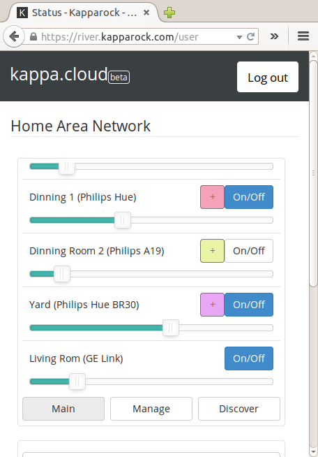
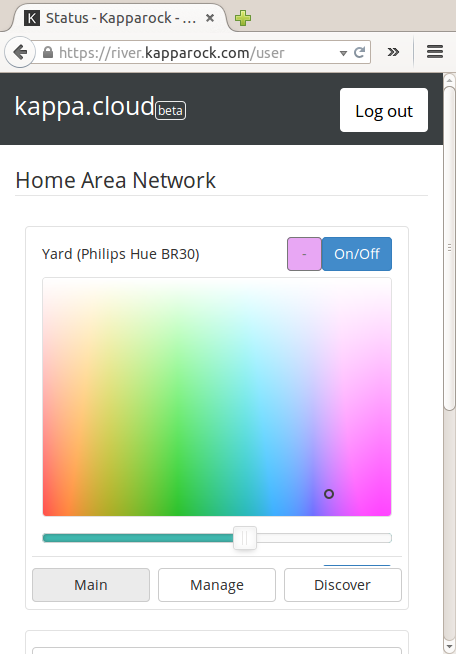
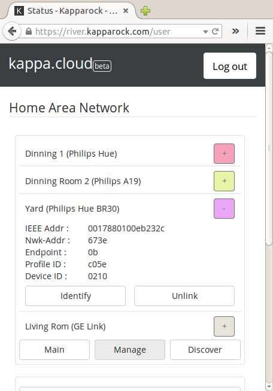

# kappaio-lighting-widget
This web UI provides a unified control interface on Zigbee Home Automation (ZHA) and Zigbee Light Link (ZLL) lighting devices


<div>



</div>


##[Video Demo](https://www.youtube.com/watch?v=trT6XApGcno)


Key functionalities includes:
* **Scan for ZLL devices** - The ability scan over all valid ZLL channels and return a list of ZLL devices that include orphaned and joined devices.
* **Factory reset a ZLL device** - This is useful when you want to take control of a device that has already joined a network or when you want to kick one out of your network. A common example is that you want to use kappaBox to control a Hue bulb that is already connected to a Hue hub or, conversely, you want the Hue hub to take back the a bulb that is currently in kappaBox network. 
* **Turning On/Off** 
* **Adjust Brightness** - You can also set the level-transition speed. 
* **Change color** - You can also et the color-transistion speed. Not all devices support this function, currently supported by Philips Hue bulbs.
* **Local Access (Internet Not Required)** - As always, if you don't feel like using any cloud service, you can open this panel through the kappaBox's gateway IP address. By default the gateway's IP is `192.168.1.1`

Devices used to test:
* GE Link
* Cree Connected
* Philips Hue wireless bulbs

##Compile & Install:
Currently kappaIO only supports cross-compilation - compilation is done by PC, and the resulting .deb package is installed to Raspberry Pi. Native compilation in PC ( yes, you run the gateway using desktop) or Raspberry Pi enviroment are in progress.

###Things you need to do in PC

To compile this package, download the ARMv7 cross-compile SDK to  :

```
git clone https://github.com/kappaIO-Dev/kappaIO-toolchain-crosscompile-armhf.git
```
Download rsserial to `package/` folder of the SDK:

```
cd kappaIO-toolchain-crosscompile-armhf/package
git clone https://github.com/kappaIO-Dev/rsserial.git
git clone https://github.com/kappaIO-Dev/kappaio-lighting-widget.git
```

Build & install:

You have to have RSSERIAL installed, if you haven't
```
cd kappaIO-toolchain-crosscompile-armhf/package/rsserial/build
./build root@192.168.1.15 
```

Having installed RSSERIAL:
```
cd kappaIO-toolchain-crosscompile-armhf/package/kappaio-lighting-widget/build
./build root@192.168.1.15 
```
Substitute the IP address with LAN IP of your Raspberry Pi.

For questions : dev@kapparock.com
